# Actividad 01 - Programacion Web II

Repositorio correspondiente a la primera actividad de la materia Programacion Web II, en la que se creó las apis en express y node.js para una simple gestion de clientes, y su respectiva conexion e integracion con un cliente frontend desarrollado en React.

---

## Indice de Pruebas y Evidencias

1. Pruebas de la API con Express (Postman)
2. Pruebas de la API con Servidor Nativo (Postman)
3. Interfaz y Consumo en React

---

## 1. Pruebas de la API con Express

A continuacion se muestran las evidencias de las peticiones HTTP realizadas al servidor de Express para el manejo de clientes (GET y POST).

- **Listado general de clientes:**
  > 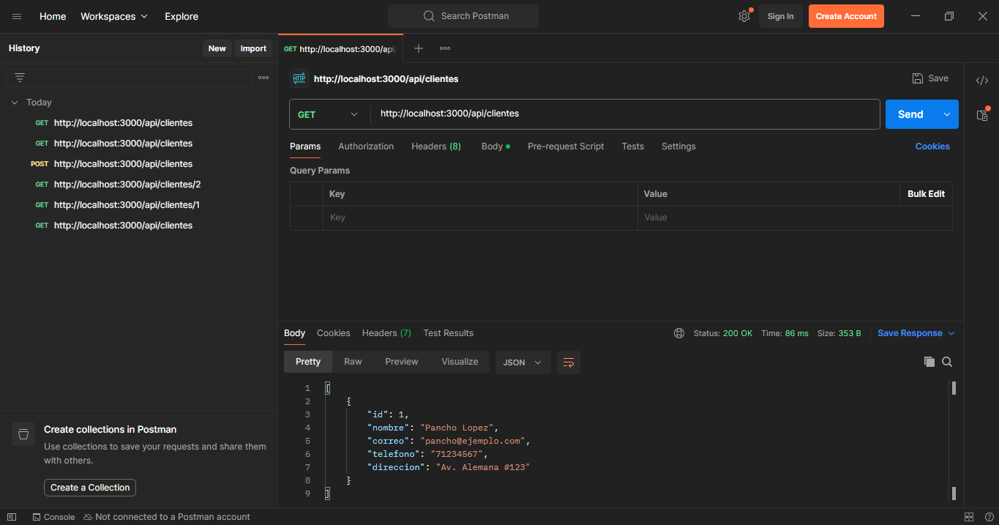

- **Consulta de clientes por ID:**
  > 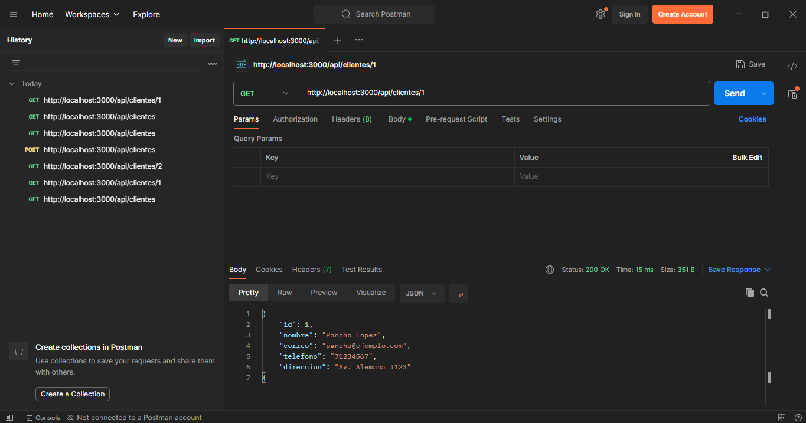
  > 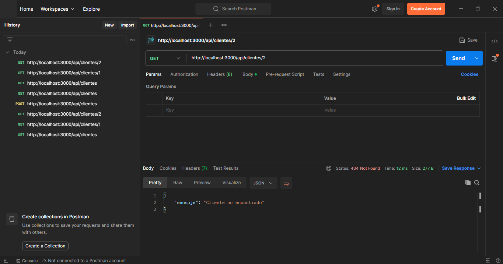

- **Registro de nuevo cliente (POST):**
  > 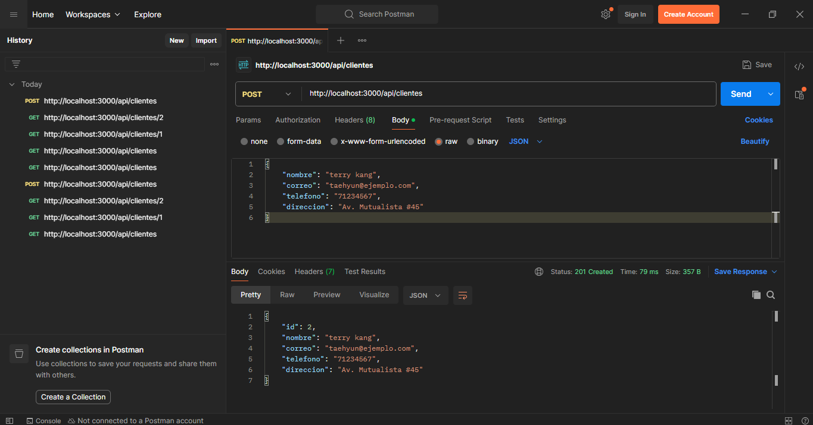

- **Consulta de clientes por ID después de POST:**
  > 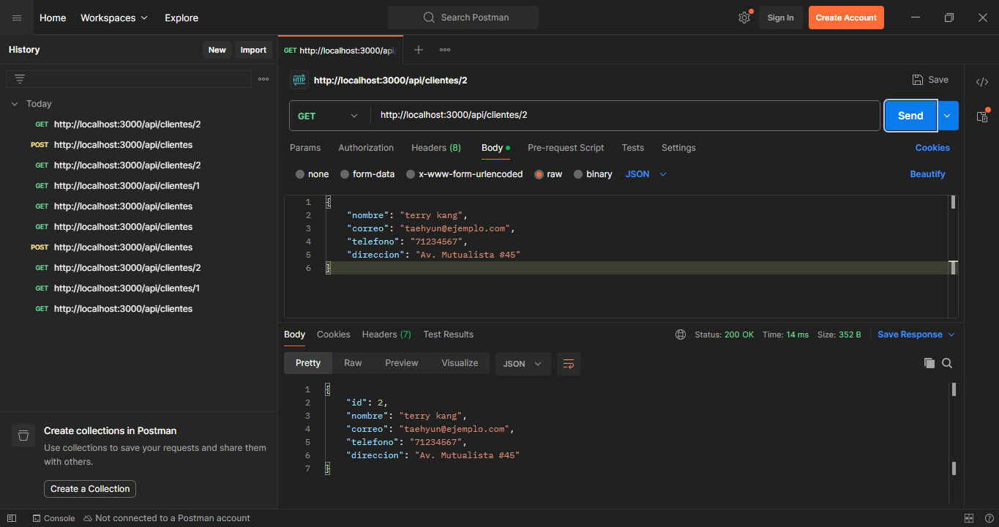
  > 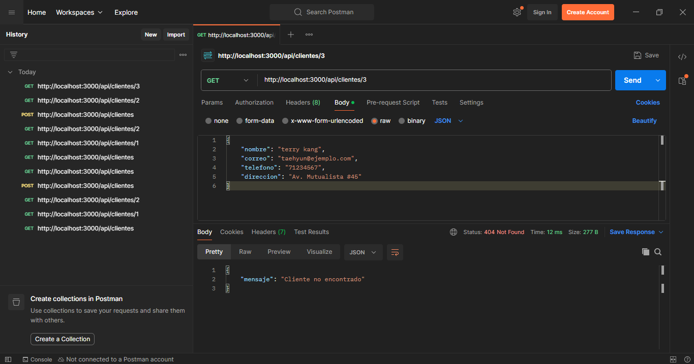

---

## 2. Pruebas de la API con Node.js (HTTP)

Evidencias de la implementacion alternativa utilizando el modulo nativo de Node.js.

- **Listado general de clientes Node.js:**
  > 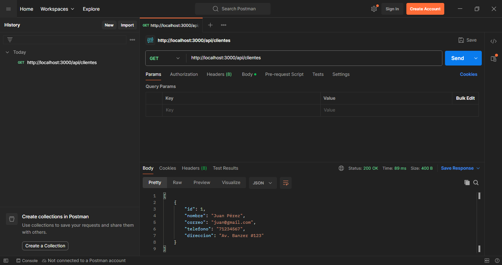

- **Consulta de clientes por ID Node.js:**
  > 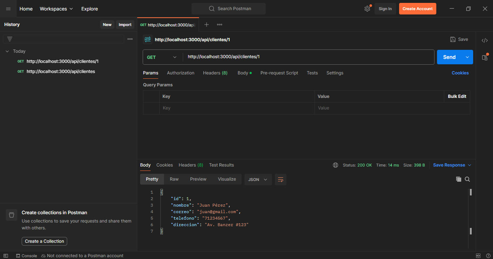
  > 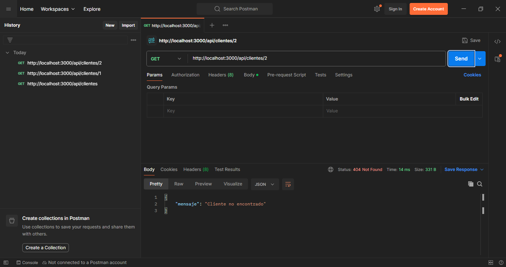

- **Registro de nuevo cliente Node.js (POST):**
  > 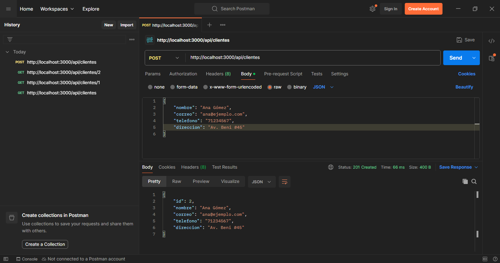

---

## 3. Integracion y Funcionamiento en React

Evidencias visuales de la aplicacion frontend en React consumiendo los endpoints de la API, mostrando el listado y el formulario de registro en tiempo real.

- **Vista principal:**
  > 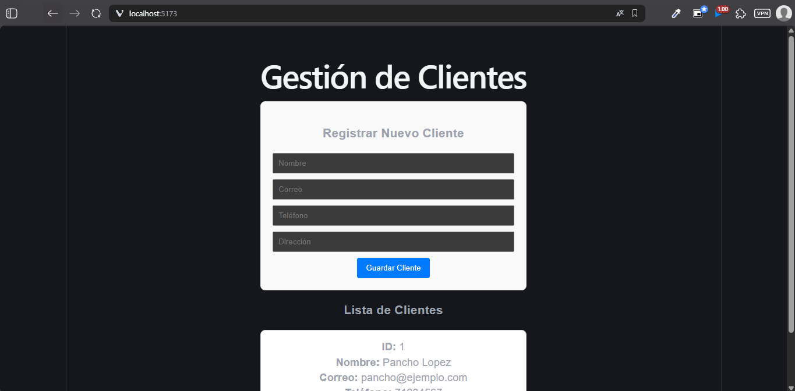

- **Vistas de interaccion y registros:**
  > 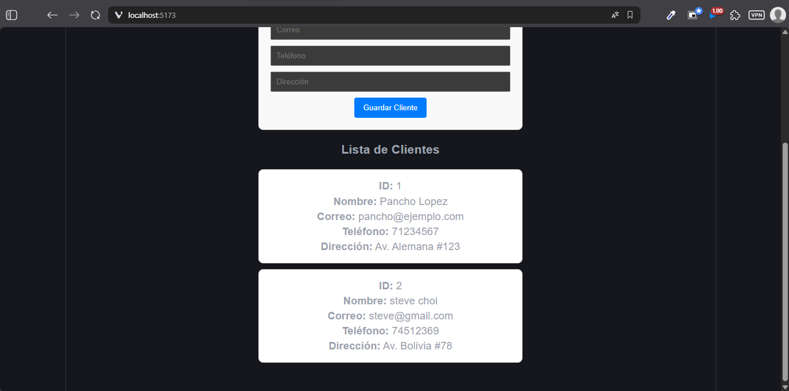
  > 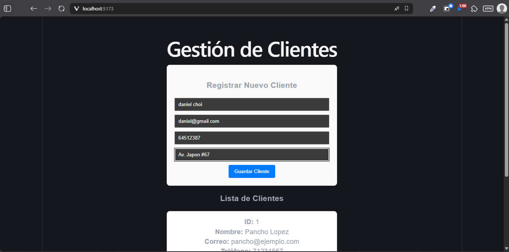
  > 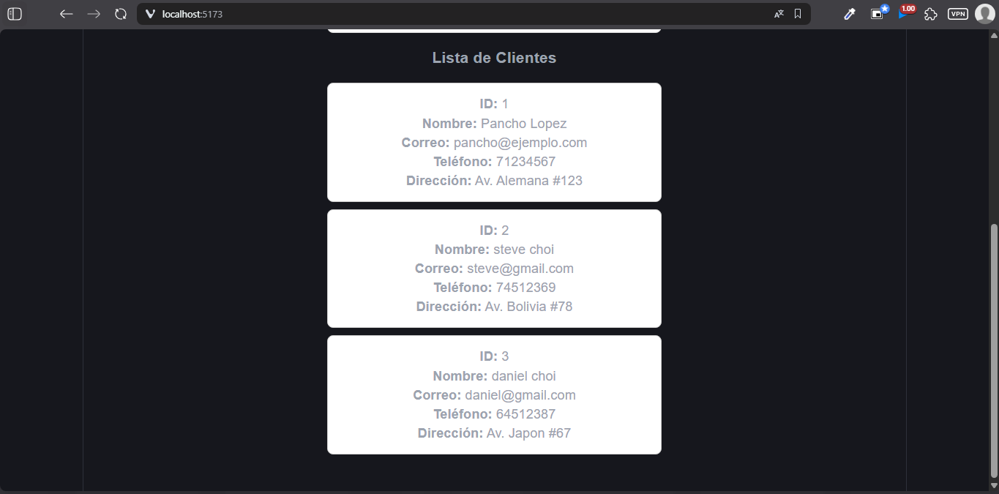

---

## Datos del Estudiante
- **Nombre:** Samira Nitza Barrientos Morales
- **Materia:** Programacion Web II
- **Actividad:** Actividad 01
